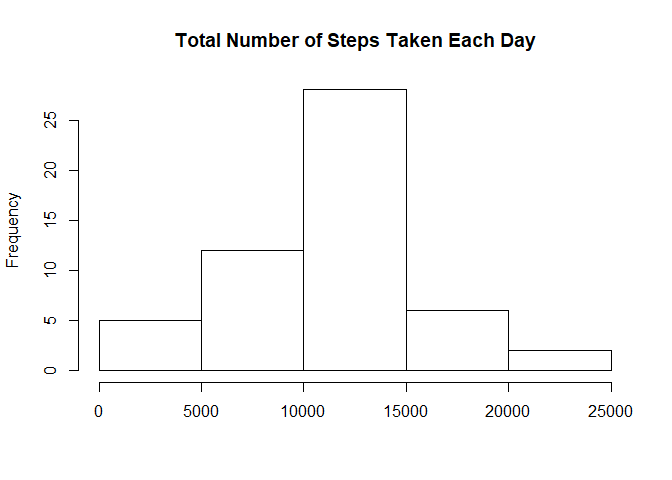
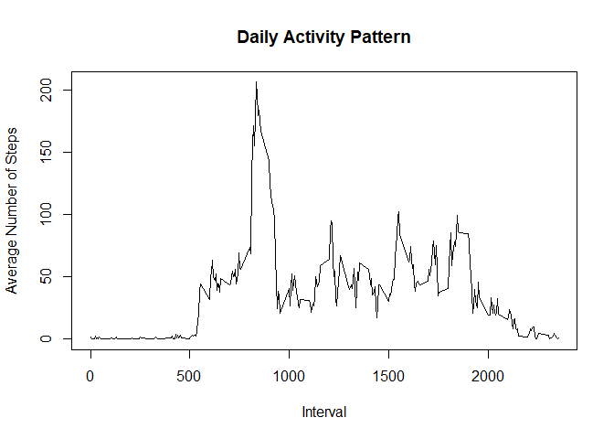
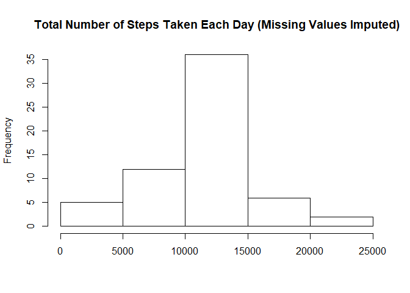
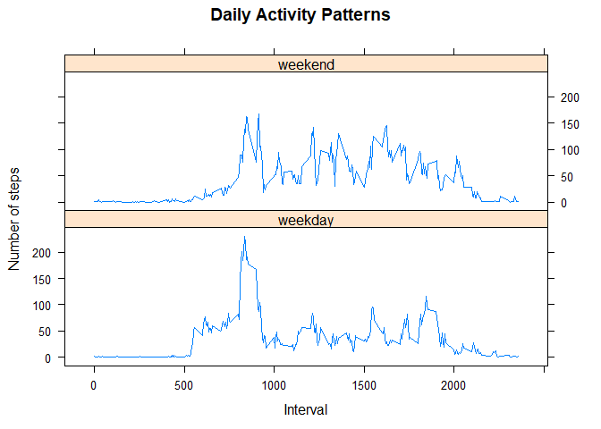

```r
# load libraries
library(knitr)
library(lattice)
library(ggplot2)
library(dplyr)
```

```
## 
## Attaching package: 'dplyr'
```

```
## The following objects are masked from 'package:stats':
## 
##     filter, lag
```

```
## The following objects are masked from 'package:base':
## 
##     intersect, setdiff, setequal, union
```

```r
opts_chunk$set(echo = TRUE)
```


## 1. Loading and preprocessing the data 

```r
# load data
if(!file.exists('activity.csv')){
    unzip('activity.zip')
}
data <- read.csv("activity.csv",na.strings = "NA")
data$date <- as.Date(data$date)

# exclude observations with missing values
data1 <- data[!is.na(data$step),]
```


## 2. What is mean total number of steps taken per day?

```r
# calculate the total number of steps taken per day
summary1 <- data1 %>% group_by(date) %>%  summarise(total = sum(steps))

# Make a histogram of the total number of steps taken each day
hist(summary1$total, main = "Total Number of Steps Taken Each Day", xlab = "")
```

<!-- -->


Mean total number of steps:

```r
mean(summary1$total) 
```

```
## [1] 10766.19
```

Median total number of steps:

```r
median(summary1$total)
```

```
## [1] 10765
```

## 3. What is the average daily activity pattern?

```r
# calculate the average number of steps taken by interval
summary2 <- data1 %>% group_by(interval) %>%  summarise(mean = mean(steps))

# Make a time series plot of the 5-minute interval and the average number of steps taken, averaged across all days
plot(summary2$interval, summary2$mean, type = "l", xlab = "Interval", ylab = "Average Number of Steps", main = "Daily Activity Pattern")
```

<!-- -->


Interval that conains the maximum number of steps:

```r
summary2$interval[summary2$mean == max(summary2$mean)]
```

```
## [1] 835
```


## 4. Imputing missing values


Total number of missing values:

```r
nrow(data[is.na(data$steps),])
```

```
## [1] 2304
```


```r
# create a vector of average number of steps per interval
aveSteps <- rep(summary2$mean, 61)

# Create a new dataset that is equal to the original dataset but with the missing data filled in with average number of steps
data3 <- data %>% mutate(stepsImputed = ifelse(is.na(steps), aveSteps, steps))

# Make a histogram of the total number of steps taken each day and Calculate and report the mean and median total number of steps taken per day. 
summary3 <- data3 %>% group_by(date) %>%  summarise(total = sum(stepsImputed))
hist(summary3$total, main = "Total Number of Steps Taken Each Day (Missing Values Imputed)", xlab = "")
```

<!-- -->

Mean total number of steps:

```r
mean(summary3$total)
```

```
## [1] 10766.19
```
Median total number of steps:

```r
median(summary3$total)
```

```
## [1] 10766.19
```


Observation: Imputing missing values did not change the mean total number of steps, but the median total number of steps increased slightly to match the mean total number of steps. Imputing missing values also changed distributions of the total number of steps. Comparing the two histograme before and after imputing missing values, the frequency for total number of steps between 10000 and 15000 increased due to replacing missing values with the mean total number of steps which falls in this range.   


## 5. Are there differences in activity patterns between weekdays and weekends?


```r
# Create a new factor variable in the dataset with two levels – “weekday” and “weekend” indicating whether a given date is a weekday or weekend day.
data3 <- data3 %>% mutate(wd = as.factor(ifelse(weekdays(date) %in% c("Saturday","Sunday"),"weekend","weekday")))
summary4 <- data3 %>% group_by(wd, interval) %>%  summarise(mean = mean(stepsImputed))

#Make a panel plot containing a time series plot of the 5-minute interval (x-axis) and the average number of steps taken, averaged across all weekday days or weekend days (y-axis). 
xyplot(mean ~ interval | wd, data = summary4, type = "l", main="Daily Activity Patterns", xlab="Interval", ylab = "Number of steps", layout=c(1,2))
```

<!-- -->


Observation: Compared with weekends, the number of steps in weekdays starts rising at an earlier point (interval around 500) and has a higher peak (over 200 steps). Between intervals 1000 and 2000, the number of steps is overall higher during weekends than during weekdays. The number starts declining at a later point during weekends (after interval 2000) than during weekdays (before interval 2000).
